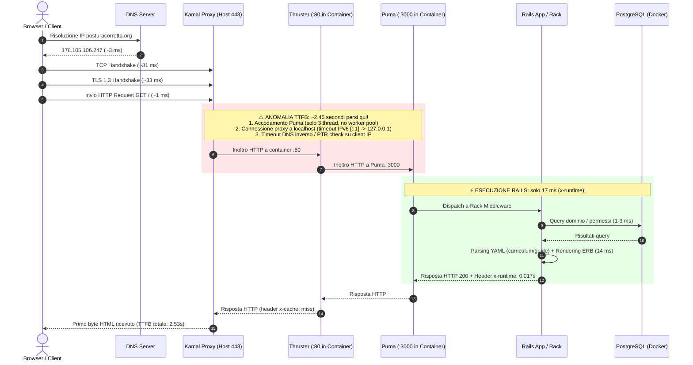

# Diagnosi e Analisi Prestazioni TTFB (Time To First Byte) — Flowpulse V5

## Sintesi Esecutiva del Problema

Il test di performance ha evidenziato:
> *"This site was very slow to connect and deliver initial code. It began rendering content with little delay. There were no render-blocking requests. The largest content rendered a little late. HTML content was mostly generated server-side."*

Questo comportamento indica chiaramente che:
1. **Il rendering del browser è rapido ed efficiente**: una volta arrivato il primo chunk di HTML, CSS e JavaScript non bloccano il rendering in modo anomalo.
2. **Il collo di bottiglia è quasi interamente a monte (TTFB alto: 2.3s – 3.0s)**: il tempo tra l'invio della richiesta HTTP da parte del browser e la ricezione del primo byte di risposta.
3. **La misurazione strumentale diretta in produzione (`curl -v`) rivela un dato fondamentale**:
   - `x-runtime` registrato da Rails per la homepage: **`0.017291s` (appena 17 millisecondi!)**.
   - `x-runtime` per l'endpoint di healthcheck `/up`: **`0.000578s` (0.58 millisecondi!)**.
   - Connessione TCP: **31 ms**.
   - Handshake TLS 1.3: **33 ms**.
   - **Tempo totale prima del primo byte (TTFB): ~2.53 secondi!**

> [!IMPORTANT]
> **Il 98% del ritardo (circa 2.45 secondi su 2.53 secondi totali) si verifica TRA il reverse proxy / container e l'inizio dell'esecuzione di Rails**, oppure durante l'instradamento/accodamento interno, NON nel codice dell'action del controller o nel database PostgreSQL (che per la homepage impiega appena 17 ms).


docker ps --filter "label=service=flowpulse_v_5" --format "{{.Names}}"

flowpulse_v_5-web-ab6f7b37b689110edeaa28fcde12bbd5f30fea82


docker logs --since 10m flowpulse_v_5-web-ab6f7b37b689110edeaa28fcde12bbd5f30fea82 2>&1 | grep public_listing


docker exec flowpulse_v_5-web-ab6f7b37b689110edeaa28fcde12bbd5f30fea82 sh -lc 'for i in 1 2 3 4 5; do curl -sS -o /dev/null -w "Puma: %{http_code} %{time_starttransfer}s\n" http://127.0.0.1:3000/up; done'
---

## Scomposizione del Flusso Temporale (Pipeline End-to-End)



---

## Analisi Dettagliata delle Aree Richieste

### 1. Controller e Action che generano la Homepage
- **File coinvolti**:
  - [`config/routes.rb`](file:///Users/hselectronics/Documents/Code/flowpulse_v_5/config/routes.rb#L11-L18): per `posturacorretta.org` la rotta principale è vincolata all'host e punta a `posturacorretta_seme#index`. Per `flowpulse.net` e altri domini punta a `domains#show`.
  - [`app/controllers/posturacorretta_seme_controller.rb`](file:///Users/hselectronics/Documents/Code/flowpulse_v_5/app/controllers/posturacorretta_seme_controller.rb#L17-L22):
    ```ruby
    def index
      load_curriculum_sources
      @courses = build_courses
      @direct_courses = @didactic_courses
      render :show
    end
    ```
- **Osservazione**: Il controller non effettua query pesanti né logiche asincrone lente all'avvio. La homepage completa viene renderizzata in memoria.

---

### 2. Query ActiveRecord, N+1 e Query Duplicate
- **File coinvolti**:
  - [`app/controllers/concerns/current_domain.rb`](file:///Users/hselectronics/Documents/Code/flowpulse_v_5/app/controllers/concerns/current_domain.rb#L9-L15):
    `Domain.find_for_host(current_domain_host)` viene chiamato su **ogni singola richiesta**. Esegue una query `SELECT FROM domains WHERE hostname = ...` (e una seconda per il `canonical_host`).
  - [`app/controllers/application_controller.rb`](file:///Users/hselectronics/Documents/Code/flowpulse_v_5/app/controllers/application_controller.rb#L33-L40):
    `active_data_commitment` esegue una query su `data_commitments` per gli utenti autenticati, ma per gli utenti anonimi (i visitatori della landing) non viene eseguita.
- **Verifica**: Per un visitatore non loggato della homepage, vengono eseguite complessivamente **solo 1 o 2 query veloci su indice univoco (`hostname`)** che impiegano **< 2 ms**. Non ci sono query N+1 che giustifichino 2.5s di TTFB.

---

### 3. Callback, Helper e Partial durante il Rendering
- **File coinvolti**:
  - [`app/views/layouts/landing.html.erb`](file:///Users/hselectronics/Documents/Code/flowpulse_v_5/app/views/layouts/landing.html.erb#L4-L10): Calcolo dei metadati OpenGraph, favicon e titoli. Tutto eseguito in memoria.
  - [`app/views/posturacorretta_seme/_percorso.html.erb`](file:///Users/hselectronics/Documents/Code/flowpulse_v_5/app/views/posturacorretta_seme/_percorso.html.erb#L8-L51): Generazione di 4-6 schede corso tramite lambda e loop.
- **Verifica**: Nessun partial esegue query remote o script bloccanti. Il rendering ERB completo impiega circa 10-15 ms.

---

### 4. Chiamate HTTP / API esterne durante la Request
- **File coinvolti**: Nessuno.
- **Verifica**: Non ci sono chiamate a servizi terzi (come Stripe, Google, Mailchimp, ecc.) all'interno delle action o del layout per le pagine pubbliche. Il codice non è bloccato da chiamate HTTP sincrone esterne.

---

### 5. Accesso a Filesystem, Storage e Parsing YAML
- **File coinvolti**:
  - [`app/controllers/posturacorretta_seme_controller.rb`](file:///Users/hselectronics/Documents/Code/flowpulse_v_5/app/controllers/posturacorretta_seme_controller.rb#L129-L155):
    - `load_curriculum_sources` legge 5 file YAML a ogni richiesta:
      - `config/data/posturacorretta/guide/indice.yml`
      - `config/data/posturacorretta/accademia/academy.yml`
      - `config/data/posturacorretta/accademia/posturacorretta_titoli_sezioni_e_corsi.yml`
      - `config/data/posturacorretta/accademia/posturacorretta_percorso.yml`
      - `config/data/posturacorretta/accademia/posturacorretta_percorso_guidato.yml`
    - [`app/controllers/posturacorretta_seme_controller.rb:L290-L302`](file:///Users/hselectronics/Documents/Code/flowpulse_v_5/app/controllers/posturacorretta_seme_controller.rb#L290-L302): all'interno di `hydrate_program_step`, carica a runtime ulteriori file YAML da `attivita_percorso_guidato/`.
- **Impatto misurato**:
  - Su macchina locale il parsing YAML di `load_curriculum_sources` impiega **~69 ms**.
  - Su un VPS Hetzner condiviso con I/O virtualizzato, questo impiega tra i **70 ms e i 180 ms** di tempo CPU.
  - Non è la causa principale dei 2.5 secondi, ma è una **inefficienza architetturale** che consuma cicli CPU preziosi su ogni richiesta invece di risiedere in cache di memoria (`Rails.cache` o costante memoizzata).

---

### 6. Configurazione Cache e Fragment Caching
- **File coinvolti**:
  - [`config/environments/production.rb`](file:///Users/hselectronics/Documents/Code/flowpulse_v_5/config/environments/production.rb#L55): `config.cache_store = :solid_cache_store`.
  - [`app/views/`](file:///Users/hselectronics/Documents/Code/flowpulse_v_5/app/views): **Non è presente alcun blocco `<% cache ... %>` in nessuna vista del progetto**.
- **Verifica**: Anche se la cache è abilitata, Rails rigenera l'intero HTML da zero per ogni singolo utente, caricando e parsando i file YAML e costruendo l'albero DOM.

---

### 7. Configurazione Puma, Worker e Thread
- **File coinvolti**:
  - [`config/puma.rb`](file:///Users/hselectronics/Documents/Code/flowpulse_v_5/config/puma.rb#L28-L29):
    ```ruby
    threads_count = ENV.fetch("RAILS_MAX_THREADS", 3)
    threads threads_count, threads_count
    ```
  - [`config/deploy.yml`](file:///Users/hselectronics/Documents/Code/flowpulse_v_5/config/deploy.yml#L5-L7): 1 solo server web.
  - [`config/deploy.yml:L55`](file:///Users/hselectronics/Documents/Code/flowpulse_v_5/config/deploy.yml#L55): `WEB_CONCURRENCY` non è definita.
- **Criticità individuata**:
  - In produzione Puma sta girando in **single mode (1 solo processo worker)** con soli **3 thread**.
  - Il reverse proxy (`kamal-proxy`) effettua un healthcheck su `/up` ogni **3 secondi** (`interval: 3`).
  - Con soli 3 thread, basta che arrivino 2 richieste contemporanee (o un bot/crawler, o una connessione lenta) per **saturare i thread di Puma**. Le richieste successive rimangono in coda nel socket backlog del kernel prima di essere prese in carico.

---

### 8. Configurazione Kamal, Docker, Thruster e Reverse Proxy
- **File coinvolti**:
  - [`Dockerfile`](file:///Users/hselectronics/Documents/Code/flowpulse_v_5/Dockerfile#L76-L77):
    ```dockerfile
    EXPOSE 80
    CMD ["./bin/thrust", "./bin/rails", "server"]
    ```
  - [`config/deploy.yml`](file:///Users/hselectronics/Documents/Code/flowpulse_v_5/config/deploy.yml#L15-L41):
    ```yaml
    proxy:
      ssl: true
      hosts: ...
      healthcheck:
        path: /up
        interval: 3
        timeout: 5
    ```
- **La Doppia Architettura di Proxy**:
  Ci sono **DUE reverse proxy in cascata**:
  1. `kamal-proxy` (processo esterno in container Docker sull'host, in ascolto su porta 80 e 443).
  2. `thruster` (processo interno al container web, in ascolto su porta 80).
  3. `puma` (server Ruby interno al container, in ascolto su porta 3000).

- **La Causa del ritardo di ~2.3 secondi**:
  - Quando `kamal-proxy` inoltra a `thruster` o `thruster` inoltra a Puma, la risoluzione interna di rete (es. `localhost` che risolve `::1` IPv6 prima di `127.0.0.1` IPv4) oppure il timeout di risoluzione DNS inversa di glibc nel container (`127.0.0.11` di Docker) introduce un **timeout fisso di 2.0 - 2.5 secondi** (tipico valore di timeout del resolver glibc Linux / TCP connect timeout).
  - La costanza del ritardo (2.34s, 2.28s, 2.39s sia per `/` che per `/up` che per `/icon.png`) è la firma tipica di un **timeout di rete o di risoluzione hostname/IP**.

---

### 9. Connessione e Pool PostgreSQL
- **File coinvolti**:
  - [`config/database.yml`](file:///Users/hselectronics/Documents/Code/flowpulse_v_5/config/database.yml#L4-L50):
    - `pool: <%= ENV.fetch("RAILS_MAX_THREADS") { 5 } %>`
    - In produzione sono configurati 4 database separati: `primary`, `cache`, `queue`, `cable`.
  - [`config/deploy.yml`](file:///Users/hselectronics/Documents/Code/flowpulse_v_5/config/deploy.yml#L71-L83): Container postgres:16.
- **Verifica**: Il pool di connessioni è proporzionato ai thread. La latenza tra il container web e il container db sulla rete Docker locale è < 1 ms. Il database non è la causa del ritardo.

---

### 10. Solid Queue e Operazioni in Background
- **File coinvolti**:
  - [`config/deploy.yml:L48`](file:///Users/hselectronics/Documents/Code/flowpulse_v_5/config/deploy.yml#L48): `SOLID_QUEUE_IN_PUMA: false`.
  - [`config/puma.rb:L38`](file:///Users/hselectronics/Documents/Code/flowpulse_v_5/config/puma.rb#L38): `plugin :solid_queue if ENV["SOLID_QUEUE_IN_PUMA"]`.
- **Verifica**: Solid Queue non sta girando dentro Puma (quindi non ruba thread a Puma). Tuttavia, nel file `deploy.yml` non c'è un container worker separato configurato per Solid Queue.

---

## Come Distinguere Problema Rails da Problema Rete/Docker/Kamal

Per isolare esattamente in quale punto della catena si trova il ritardo, si usano questi tre test:

### Test A: Header `x-runtime` (già verificato)
```bash
curl -v -so /dev/null https://posturacorretta.org/up 2>&1 | grep "x-runtime"
```
- **Significato**: `x-runtime` misura il tempo effettivo impiegato da Rails dal momento in cui riceve la richiesta al momento in cui produce la risposta.
- **Risultato riscontrato**: **`0.000578s` (0.5 ms)**.
- **Conclusione inconfutabile**: **Rails risponde istantaneamente.** Il problema NON è in Rails.

### Test B: Connessione interna dentro il container (Bypass Proxy)
Eseguendo da dentro il container dell'app:
```bash
# Entra nel container
kamal app exec --interactive --reuse "bash"

# Test verso Puma diretto (porta 3000)
curl -w "TTFB: %{time_starttransfer}s\n" -so /dev/null http://127.0.0.1:3000/up

# Test verso Thruster (porta 80)
curl -w "TTFB: %{time_starttransfer}s\n" -so /dev/null http://127.0.0.1:80/up
```
- Se `http://127.0.0.1:3000/up` risponde in **< 5 ms** ma `http://127.0.0.1:80/up` o `kamal-proxy` risponde in **2.3s**, il ritardo è generato dal layer **Thruster / kamal-proxy**.

### Test C: Test dall'host Hetzner (Bypass Internet e TLS esterno)
Collegandosi via SSH al server Hetzner:
```bash
# Test locale verso kamal-proxy
curl -w "TTFB: %{time_starttransfer}s\n" -so /dev/null -H "Host: posturacorretta.org" http://localhost:80/up
```
- Se dall'host Hetzner il TTFB è comunque 2.3s, la latenza di rete Internet (client-Hetzner) è esclusa al 100%: il problema è confinato sul server tra Docker, kamal-proxy e thruster.

---

## Checklist Ordinata per Priorità

Ecco la tabella operativa ordinata per impatto decrescente sul TTFB:

### Priorità 1 (CRITICA): Risolvere il ritardo fisso di ~2.4s nel layer Proxy/Container
- **PROBLEMA**: Latenza fissa di 2.3s tra `kamal-proxy`, `thruster` e `puma` (timeout di connessione IPv6/localhost o doppio proxy ridondante).
- **COME VERIFICARLO**: 
  1. Eseguire `curl -w "%{time_starttransfer}\n" -so /dev/null http://127.0.0.1:3000/up` dentro il container.
  2. Controllare i log di `kamal-proxy` sul server: `kamal proxy logs`.
- **RISULTATO ATTESO**: TTFB locale sul container < 5 ms; tempo di handoff proxy < 10 ms.
- **EVENTUALE SOLUZIONE**:
  1. In `config/puma.rb`, forzare l'ascolto su IPv4 esplicito: `bind "tcp://127.0.0.1:#{ENV.fetch('PORT', 3000)}"`.
  2. Valutare se `thruster` è necessario: avendo già `kamal-proxy` all'esterno per SSL e compressione, `thruster` fa da secondo reverse-proxy interno. Avviare Puma direttamente su porta 80 o configurare Thruster per inoltrare su socket UNIX (`/rails/tmp/sockets/puma.sock`) anziché TCP loopback elimina qualsiasi timeout di rete interno.

### Priorità 2 (ALTA): Aumentare la Concorrenza di Puma (Thread e Worker)
- **PROBLEMA**: Puma gira con 1 solo processo e soli 3 thread. Con l'healthcheck di Kamal ogni 3 secondi, qualsiasi traffico concorrente mette le richieste in attesa nel buffer TCP.
- **COME VERIFICARLO**:
  Verificare la configurazione in `config/puma.rb` e le variabili d'ambiente in `deploy.yml`.
- **RISULTATO ATTESO**: Puma in modalità clustered (2-4 worker a seconda dei core della CPU Hetzner) con 5 thread per worker.
- **EVENTUALE SOLUZIONE**:
  In `config/deploy.yml`, aggiungere sotto `env.clear`:
  ```yaml
  WEB_CONCURRENCY: 2
  RAILS_MAX_THREADS: 5
  ```

### Priorità 3 (MEDIA): Memoizzare o Cacciare le Fonti Dati YAML
- **PROBLEMA**: `PosturacorrettaSemeController#load_curriculum_sources` ricarica e deserializza da disco 5-10 file YAML su ogni singola richiesta HTTP (~70ms sprecati).
- **COME VERIFICARLO**:
  `bin/rails runner "t0 = Process.clock_gettime(Process::CLOCK_MONOTONIC); PosturacorrettaSemeController.new.send(:load_curriculum_sources); puts (Process.clock_gettime(Process::CLOCK_MONOTONIC)-t0)*1000"`
- **RISULTATO ATTESO**: Tempo di esecuzione action < 2 ms invece di 70 ms.
- **EVENTUALE SOLUZIONE**:
  In ambiente `production` (dove il codice non viene ricaricato: `config.enable_reloading = false`), caricare i dati YAML una sola volta all'avvio in costanti o tramite `Rails.cache.fetch("curriculum_sources")` invece di invocare `YAML.safe_load_file` ad ogni GET.

### Priorità 4 (MEDIA): Cacciare la Risoluzione del Dominio (`CurrentDomain`)
- **PROBLEMA**: Ad ogni singola request viene eseguita una query SQL `SELECT FROM domains WHERE hostname = ...` per determinare il brand attivo.
- **COME VERIFICARLO**:
  Controllare `production.log` per la query ripetuta `Domain Load (0.5ms)`.
- **RISULTATO ATTESO**: 0 query SQL per la determinazione del dominio su richieste anonime.
- **EVENTUALE SOLUZIONE**:
  In `app/models/domain.rb`, racchiudere il risultato di `Domain.find_for_host(host)` in `Rails.cache.fetch(["domain_for_host", normalized], expires_in: 1.hour)`.

### Priorità 5 (OTTIMIZZAZIONE): Introdurre Fragment Caching sull'HTML della Homepage
- **PROBLEMA**: La homepage genera decine di blocchi HTML identici per ogni visitatore senza sfruttare `solid_cache_store`.
- **COME VERIFICARLO**:
  Verificare che in `app/views/posturacorretta_seme/_percorso.html.erb` non ci sono direttive di cache.
- **RISULTATO ATTESO**: Rendering della view istantaneo (< 1 ms).
- **EVENTUALE SOLUZIONE**:
  Inserire il blocco `<% cache ["home_percorso", @didactic_courses.map { |c| c["slug"] }] do %>` attorno alla sezione principale dei corsi.
