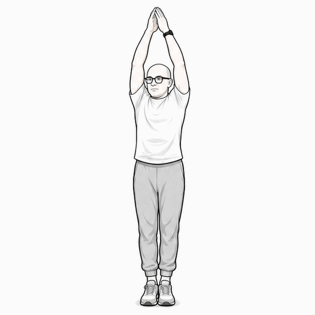
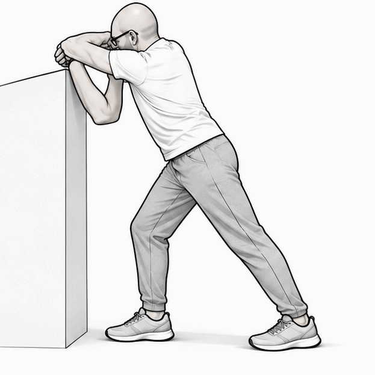
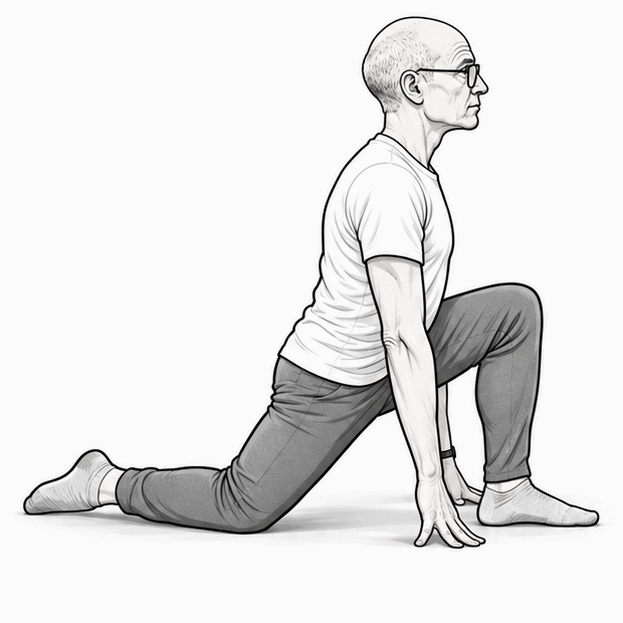
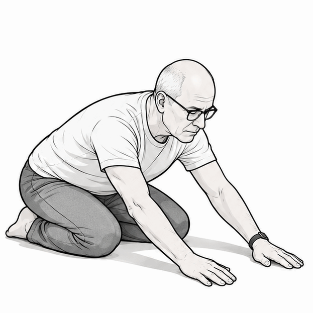
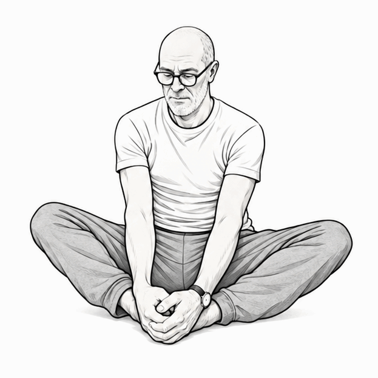
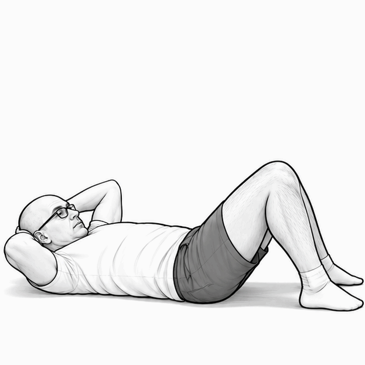
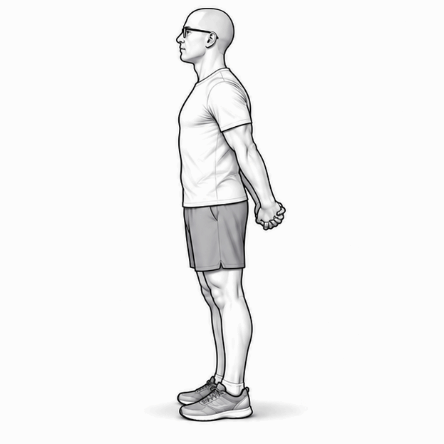
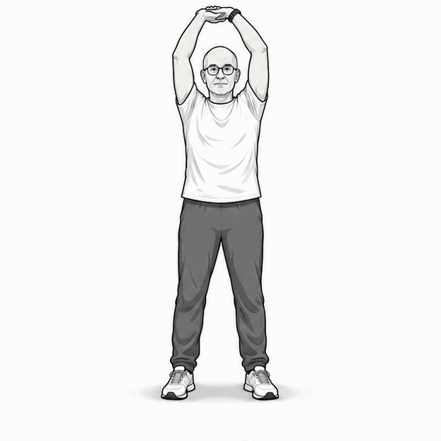
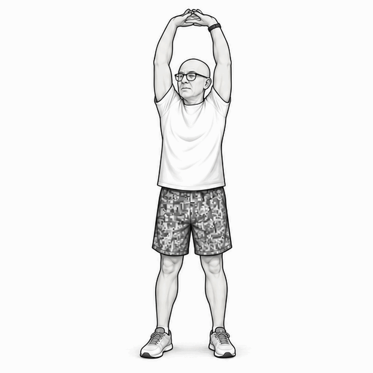
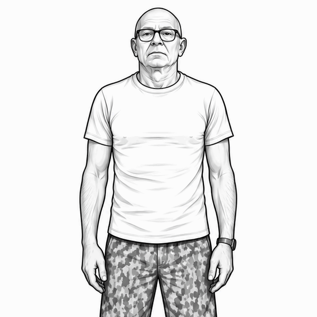

# Mobilità a secco per il nuoto

Prima scheda MVP per una repository di esercizi. Le immagini sono stilizzate, su sfondo neutro, pensate per essere riutilizzate in GitHub, HTML, contenuti editoriali o piattaforme future.

> Le indicazioni sono orientative. Prima dell'uso pubblico conviene rivedere la scheda dal punto di vista tecnico e didattico.

## 01. Allungamento in alto

**Obiettivo:** allungare spalle, tronco e catena anteriore.  
**Esecuzione:** in piedi, porta le braccia verso l'alto e mantieni un allungamento confortevole.  
**Dose indicativa:** 15–25 secondi × 2.

## 02. Stretching spalle al muro

**Obiettivo:** mobilizzare spalle e dorsale.  
**Esecuzione:** appoggia gli avambracci a un supporto stabile e accompagna il busto avanti e in basso senza forzare.  
**Dose indicativa:** 15–25 secondi × 2 per lato.

## 03. Affondo anca e psoas

**Obiettivo:** mobilità di anca e catena anteriore.  
**Esecuzione:** con un ginocchio a terra e l'altro piede avanti, sposta delicatamente il bacino in avanti.  
**Dose indicativa:** 15–25 secondi × 2 per lato.

## 04. Scarico lombare

**Obiettivo:** decomprimere schiena e spalle.  
**Esecuzione:** siediti verso i talloni e allunga le braccia in avanti, respirando in modo lento.  
**Dose indicativa:** 20–30 secondi × 2.

## 05. Posizione seduta a farfalla

**Obiettivo:** aprire anche e zona interna delle cosce.  
**Esecuzione:** da seduto, unisci le piante dei piedi e lascia scendere le ginocchia senza forzare.  
**Dose indicativa:** 20–30 secondi × 2.

## 06. Addominali dolci

**Obiettivo:** attivare addome e controllo del tronco.  
**Esecuzione:** da supino con ginocchia piegate, solleva leggermente testa e spalle espirando.  
**Dose indicativa:** 6–10 ripetizioni lente.

## 07. Apertura pettorali

**Obiettivo:** aprire torace e cintura scapolare.  
**Esecuzione:** in piedi, intreccia le mani dietro la schiena e accompagna le braccia indietro senza irrigidire la zona lombare.  
**Dose indicativa:** 15–20 secondi × 2.

## 08. Allungamento laterale

**Obiettivo:** mobilità laterale del tronco.  
**Esecuzione:** con le braccia sopra la testa, inclina il busto lateralmente mantenendo stabile il bacino.  
**Dose indicativa:** 15–20 secondi × 2 per lato.

## 09. Allungamento braccia sopra testa

**Obiettivo:** lavoro leggero su braccia, spalle e asse del corpo.  
**Esecuzione:** porta le mani unite sopra la testa e mantieni un'estensione comoda.  
**Dose indicativa:** 15–20 secondi × 2.

## 10. Spalle e trapezi

**Obiettivo:** mobilità delle spalle e percezione del cingolo scapolare.  
**Esecuzione:** solleva le spalle lentamente verso l'alto e rilasciale in modo controllato.  
**Dose indicativa:** 8–12 ripetizioni.

## Uso della scheda

Questa scheda può essere:
- pubblicata in una repository GitHub;
- inserita in contenuti editoriali;
- associata a video del canale YouTube;
- riutilizzata in una futura piattaforma di corsi e percorsi.
